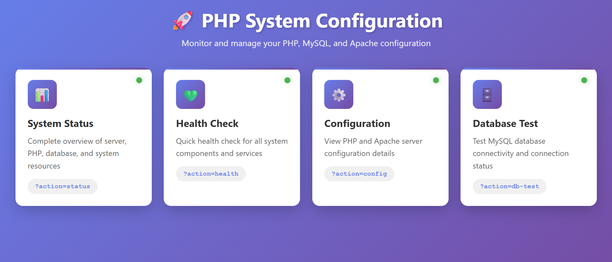
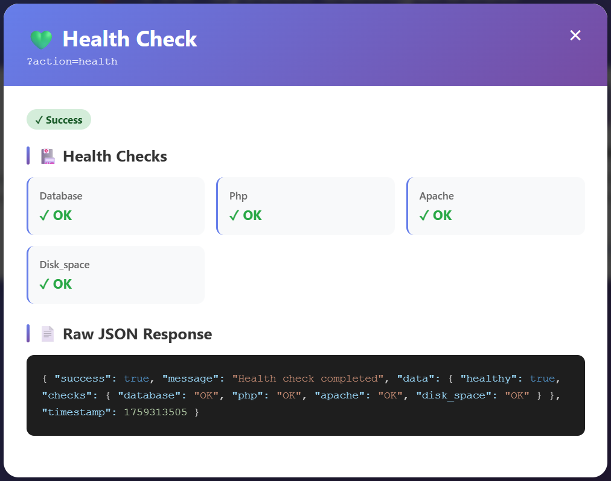

একটা **Dockerized LAMP Stack (Linux + Apache + MySQL + PHP)** সেটআপ, যেখানে আপনি Apache-PHP সার্ভার, MySQL ডাটাবেস, আর phpMyAdmin একসাথে চালাতে পারবেন।




### 🔹 প্রজেক্ট কাঠামো

```
appdocker/
│── docker-compose.yml   # সার্ভিস ডিফাইন করা আছে (web, db, phpmyadmin)
│── Dockerfile           # php:7.4-apache এর উপর কাস্টম বিল্ড (mysqli + pdo)
│── build.sh             # কন্টেইনার রিস্টার্ট/রিবিল্ড স্ক্রিপ্ট
│── www/                 # ওয়েব রুট (PHP অ্যাপ ফাইলগুলো এখানে)
│   ├── index.php        # PHP Info / সিস্টেম কনফিগারেশন আউটপুট
│   ├── api.ph           # API এর মতো PHP সিস্টেম স্ট্যাটাস/হেলথচেক
│   └── db.php           # MySQL কানেকশন টেস্ট স্ক্রিপ্ট
```

---

### 🔹 সার্ভিস (docker-compose.yml অনুযায়ী)

1. **web (php-apache)**

   * PHP 7.4 + Apache
   * `./www` → `/var/www/html` (কোড ডিরেক্টরি মাউন্ট করা)
   * Port: `8082 → 80`

2. **db (mysql-container)**

   * MySQL 8.0
   * Root password: `nopass`
   * ডিফল্ট ডাটাবেস: `mydb`
   * ইউজার: `user` / `userpass`
   * Port: `3306:3306`
   * Data volume: `mysql-data`

3. **phpmyadmin (phpmyadmin-container)**

   * phpMyAdmin 4.9
   * PMA_HOST → `mysql-container`
   * Port: `8080 → 80`

---

### 🔹 Dockerfile (php-apache কাস্টমাইজড)

* PHP এক্সটেনশন ইনস্টল করা হয়েছে:

  * `mysqli`
  * `pdo`
  * `pdo_mysql`

---

### 🔹 build.sh স্ক্রিপ্ট

* `docker-compose down` → সব কন্টেইনার বন্ধ/রিমুভ
* `docker-compose build --no-cache` → ক্লিন বিল্ড
* `docker-compose up -d` → ব্যাকগ্রাউন্ডে কন্টেইনার চালানো

---

### 🔹 www/ এর ফাইলসমূহ

1. **index.php** → PHP 7.4 info, Apache config, loaded modules ইত্যাদি দেখায়।
2. **api.php** →

   * `?action=status` → সিস্টেম স্ট্যাটাস
   * `?action=health` → হেলথচেক
   * `?action=config` → কনফিগারেশন
   * `?action=db-test` → ডাটাবেস কানেকশন টেস্ট
3. **db.php** → ডাটাবেস কানেকশন সফল হলে MySQL schema লিস্ট দেখায়।

---

### 🔹 কী কাজ করে?

* **ওয়েব সার্ভার**: `http://localhost:8082` → আপনার PHP অ্যাপ রান করবে
* **phpMyAdmin**: `http://localhost:8080` → ডাটাবেস GUI access